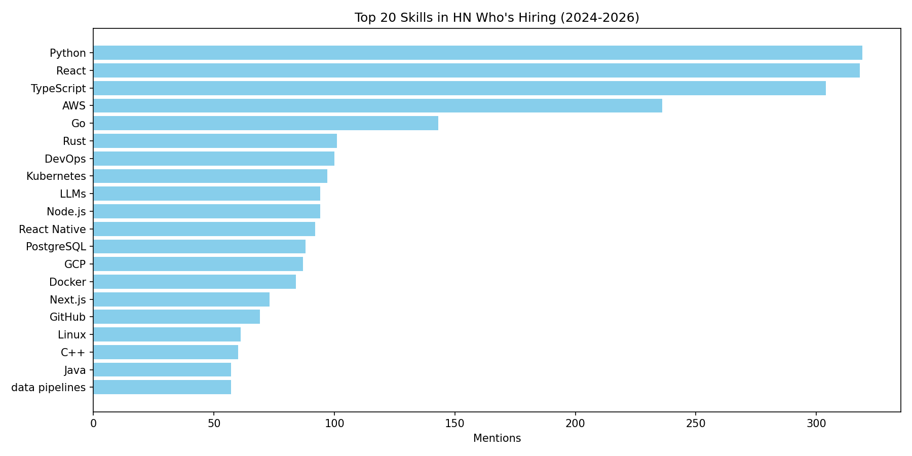

# SkillRadar

Automated extraction and analysis of in-demand skills from HN job postings.

## What it does

SkillRadar processes job postings and extracts the skills employers actually ask for — ranked by frequency, tracked over time, and visualized in an interactive dashboard.

## Why it exists

The AI job market moves fast. This tool makes the signal visible.

## Live Demo

👉 [skill-radar.streamlit.app](https://skill-radar.streamlit.app)

## Stack

- Python · Pandas · spaCy · scikit-learn
- Streamlit (interactive dashboard)
- Data: HackerNews "Who is Hiring" — live via Firebase API

## Status

- ✅ Phase 1: EDA on manual data, skill extraction, visualization
- ✅ Phase 2: HackerNews API integration, automated collection (1,579 job postings, 30 threads, 2024–2026)
- ✅ Phase 3: NLP extraction pipeline, skill frequency analysis, time-series charts, Streamlit dashboard
- 🔧 Phase 4: Additional data sources, visualization refinement